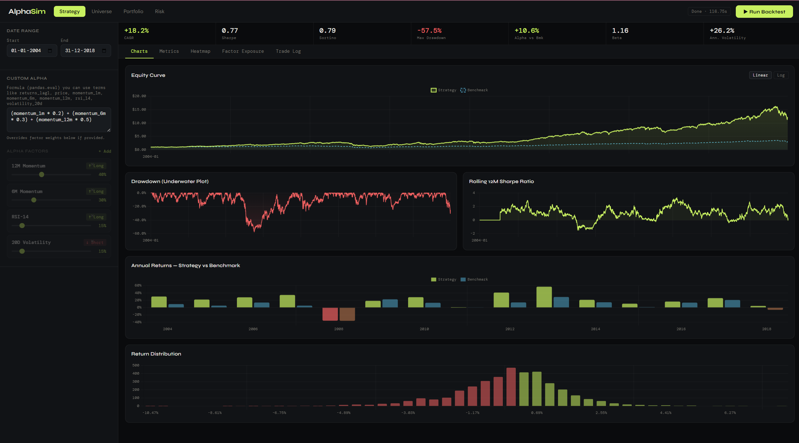

# AlphaSim — Quantitative Backtest Platform

A professional-grade alpha simulator with a vectorized Python backtest engine and a full-featured dark-themed web UI.

## Features

- **500-stock synthetic universe** (2002–2018) with realistic sector dynamics, crisis periods, and fundamentals
- **8 alpha factors**: returns_lag1, price, momentum_1m, momentum_6m, momentum_12m, rsi_14, volatility_20d
- **Portfolio construction**: Equal / signal / market-cap weighting, max positions, weight caps
- **Transaction cost modeling**: Configurable slippage + commission (basis points)
- **Circuit breakers**: Max drawdown stop
- **Full metrics suite**: Sharpe, Sortino, Calmar, Omega, Information ratio, Treynor, VaR, CVaR, Alpha, Beta, Active share
- **Rich visualizations**: Equity curve, drawdown, rolling Sharpe, annual returns, return distribution, monthly heatmap, rolling beta

## Setup

### Requirements
- Python 3.10+
- pip

### Install

```bash
cd alphasim
pip install -r requirements.txt
```

### Run

```bash
python -m uvicorn app:app --reload --port 8000
```

Then open: http://localhost:8000

## Using Real Data

Replace `generate_universe()` in `data_loader.py` with your own data source.
The function must return a DataFrame with these columns:

| Column | Type | Description |
|--------|------|-------------|
| ticker | str | Stock ticker |
| sector | str | GICS sector |
| market_cap_tier | str | Mega/Large/Mid/Small/Micro |
| date | datetime | Trading date |
| price | float | Adjusted close price |
| returns | float | Daily return |
| volume | float | Daily volume |
| pe_ratio | float | Price / Earnings |
| pb_ratio | float | Price / Book |
| roe | float | Return on equity |
| debt_equity | float | Debt / Equity ratio |
| earnings_yield | float | 1 / PE |
| momentum_12m | float | 12-month trailing return |
| rsi_14 | float | 14-day RSI |
| accruals_ratio | float | Accruals / Assets |
| adv | float | Average daily volume ($) |
| beta | float | Market beta |

## Architecture

```
alphasim/
├── app.py           # FastAPI server
├── engine.py        # Vectorized backtest engine + metrics
├── data_loader.py   # Synthetic data generator / real data interface
├── requirements.txt
├── README.md
└── static/
    └── index.html   # Full single-file frontend (Chart.js)
```

## API Endpoints

| Method | Path | Description |
|--------|------|-------------|
| GET | / | Frontend |
| GET | /api/meta | Factor definitions, sectors, caps |
| POST | /api/backtest | Run backtest, returns full results |
| GET | /api/health | Health check |

### POST /api/backtest

```json
{
  "start_date": "2004-01-01",
  "end_date": "2018-12-31",
  "factors": [
    {"name": "earnings_yield", "weight": 0.35, "higher_is_better": true},
    {"name": "momentum_12m",   "weight": 0.30, "higher_is_better": true}
  ],
  "max_positions": 50,
  "max_weight": 0.05,
  "weighting": "equal",
  "rebalance_freq": "M",
  "slippage_bps": 10,
  "commission_bps": 5,
  "max_drawdown_stop": 0.20
}
```
